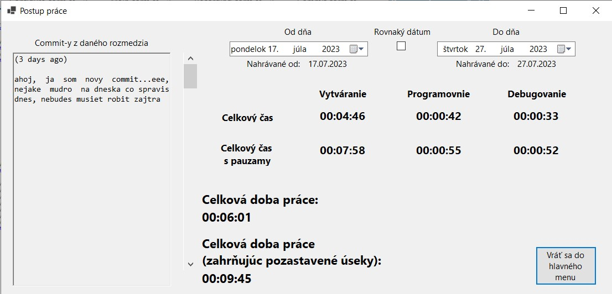

# Uživatelská dokumentácia - Work Tracer

## Popis

---

- Aplikácia s grafickým uživatelským rozhraním slúžiaca na zaznamenávanie času strávenom na práci uživatela na danom projekte.  

---

- Obsahuje prezeranie výsledkov, nastavenie jazyka a módu nahrávania a prezeranie commitov uživatela v danom projekte
- ako mód projektu si uživateľ môže vybrať z dvoch možností
  - *lokálny mód*
    - vybraný projekt nemusí obsahovať git-ový repozitár
    - nieje potrebné, aby bol vybraný priečinok s Tortoise Git aplikáciou
    - okná zobrazujúce commity budú vypisovať príslušnú hlášku, že je nastavený lokálny mód
  - *repozitárový mód*
    - vybraný projekt by musí byť zahrnutý v nejakom gitovom repozitáry
    - je potrebné, aby bol vybraný priečinok s Tortoise Git aplikáciou *
    - vyšie zmienené okná budú ukazovať príslušné commity projektu
- za jazyk si uživatel môže vybrať z:
  - *anglického*
  - *slovenského*

> \* pokiaľ chce užívateľ pracovať aj v repozitárovom móde, musí mať pred spustením nainštalovanú aplikáciu [TortoiseGit](https://tortoisegit.org/download/), ideálne verzie 2.14.0, pri novších a starších verziách nieje zaručená funkčnosť aplikácie 

## Zaobchádzanie s aplikáciou

### spustenie aplikácie

- aplikácia sa súšťa pomocou spustitelného súboru .exe alebo odkazu naňho
- po spustení sa objaví na obrazovke hlavné menu

### hlavné menu

- vydíme tu tri tlačidlá a okno zobrazujúce posledný commit projektu (momentálne s nápisom oznamujúcim, že je zapnutý lokálny mód)
- tlačidlá slúžia na:
  - *Začni nahrávať* - zobrazí uživatelovi okno, kde môže začať zaznamenávať svoju prácu
  - *Pozri postup práce* - otvorí sa okno, kde môže uživateľ prezerať výsledné hodnoty nahrávania
  - *Otvor nastavenia* - otvorí okno nastavení

- ďalej sa tu nachádzajú nápisi oznamujúce aktuálny stav a mód nahrávania
- taktiež pod tlačidlom *Otvor nastavenia* sa v prípade nutnosti  zobrazia nápisy označujúce neplatnosť niektorého z dvoch zdrojových priečinkov

### nastavenia

- nachádzajú sa tu 4 možnosti nastavenia aplikácie:
  - **Vyber mód** - pomocou *track bar*-u si môžeme vybrať medzi repozitárovým a lokálnym módom
  - **Nastav jazyk** - znova pomocou track bar-u si môžeme nastaviť jazyk aplikácie podľa svojej ľúbosit
  - **Vyber adresár s tortoise git**
    - po zmačknutí tlačidla *Vyber* sa otvorí dialógové okno, v ktorom uživatel môže vybrať priečinok, v ktorom je umiestnený spustitelný súbor *TortoiseGitProc.exe*
    - daný súbor sa bude najskôr nachádzať v *cesta ku priecinku s TortoiseGit\\Nazov priecinka vybrany pri instalacii\\bin* (napr.: C:\\Program Files\\TortoiseGit\\bin)
    - nemusí byť vybraný v lokálnom móde
  - **Vyber adresár s projektom**
    - po zmačknutí tlačidla *Vyber* sa otvorí dialógové okno, v ktorom si uživatel môže vybrať priečinok s projektom, ktorý bude chcieť zaznamenávať
    - pokiaľ je zapnutý repozitárový mód, je potrebné, aby priečinok bol súčasťou nejakého git-ového repozitára
      - ak nieje súčasťou žiadneho repozitára, opýta sa aplikácia uživatela, či tam chce vytvoriť nový repozitár
- tlačidlom **Vráť sa** sa vrátime do okna, z ktorého sme do nastavení prišli

- pokiaľ je niektorý zo zdrojov nevalídny, vypíše sa cesta k danému zdroju červeným písmom a ukáže sa správa oznamujúca tento problém

### nahrávanie

- v okne sa nachádzajú:
  - tri tlačidlá pre pre nahrávanie, track bar pre výber vývojových fází
  - dve tlačidlá pre:
    - vstup do nastavení (**Otvor nastavenie**)
    - návrat do hlavného menu (**Vráť sa do hlavného menu**)

- tlačidlá pre náhrávanie z ľava sú:
  1. tlačidlo pre **spustenie** nahrávania
  2. tlačidlo pre **pozastavenie** nahrávania
  3. tlačidlo pre **zastavenie nahrávania**

- pokiaľ je aktívy *repozitárový mód*, po zastavení nahrávania sa otvorí okno, ktoré sa pýta uživatela, či chce commitnúť svoju  spravenú prácu
  - pokiaľ je jeho odpoveď kladná, otvorí sa okno aplikácie Tortoise Git, kde uživatel môže spraviť všetky možné úpravy svojho commit-u a následhne aj poslať svoje zmeny na server
  - po dokončení tejto akcie je uživatel opäť vrátený do okna nahrávania

- nahrávnaie je znemožnené pokiaľ nieje vybraný valídny projekt alebo valídny priečinok s Tortoise Git-om

### prezeranie výsledkov

v prezeraní výsledkov sa nachádzajú:

- dve kolonky pre výber časového intervalu:
  - **Odo dňa** - výber počiatočného dátumu
  - **Do dňa** - výber koncového dátumu
- okno pre zobrazovanie commit-ov
  - toto okno je aktívne iba počas aktívneho *repozitárového módu*
  - toto okno má pri sebe *scroll bar*, ktorým sa dá listovať medzi jednotlivými commit-mi
  - v okne sa budú zobrazovať len commity z časového rozsahu vybraného v horných kolonkách okna
  - commit je doplnený o časový údaj, ktorý vraví, pred koľkými dňami bol daný commit spravený ((3 days ago))
- číselné údaje vyjadrujúce dobu strávenú prácou na projekte
  - dve hodnoty na spodu ukazujú celkový počet hodín, strávených na práci na projekte
    - prvé hovorí o čistom čase práce
    - druhé započítava do výsledku aj dobu pozastavenia nahrávania
  - hodntoy v hornej tabuľke hovoria to isté, avšak pre jednotlivé fázy nahrávania
  - hodntoy sú, podobne ako zobrazované commity, počítané z rozshau daného dátumovými kolonkami vo vrchnej časti okna
- v hornej časti medzi kolonkami sa ešte náchadza aj *check box* **Rovnaký dátum**, ktorý po zakliknutí zapríčiní, že sa obidve kolonky nastavia na rovnaký dátum a teda bude možné prezerať výsledky práce v jednotlivých dňoch bez otravného nastavovania obidvoch koloniek
- tlačidlom **Vráť sa do hlavného menu** sa vrátime do hlavného menu :-)

prezeranie výsledkov nieje možné, pokiaľ nieje vybraný valídny projekt

### zatvorenie aplikácie

- aplikácia sa zatvára jednoduchým zatvorením jedného z okien aplikácie
- pokiaľ náhodou nieje zastavené nahrávanie, aplikácia na to upozorní uživatela pred zavretím a opýta sa ho, či naozaj chce aplikáciu opustiť